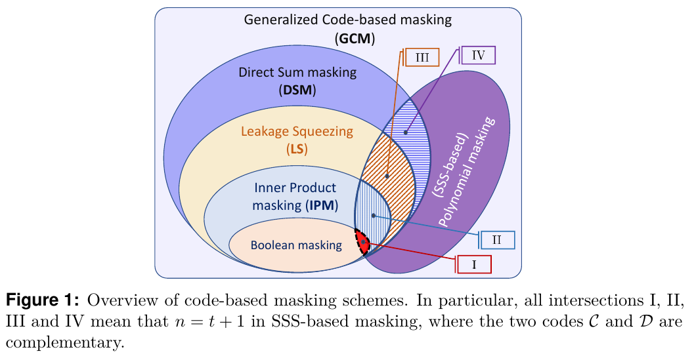
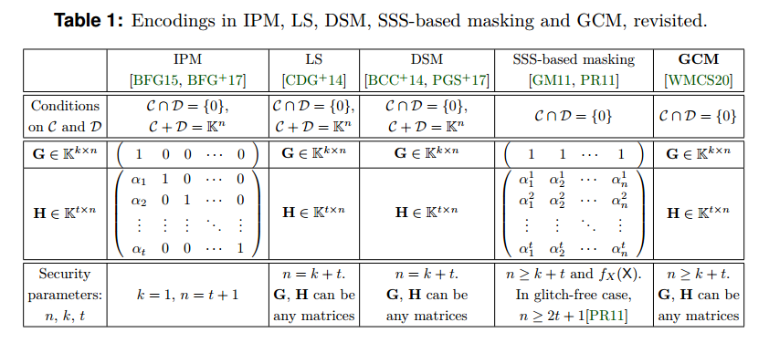
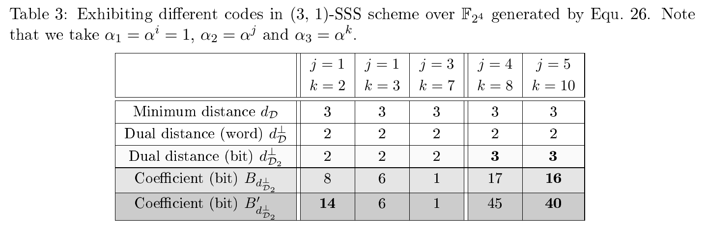
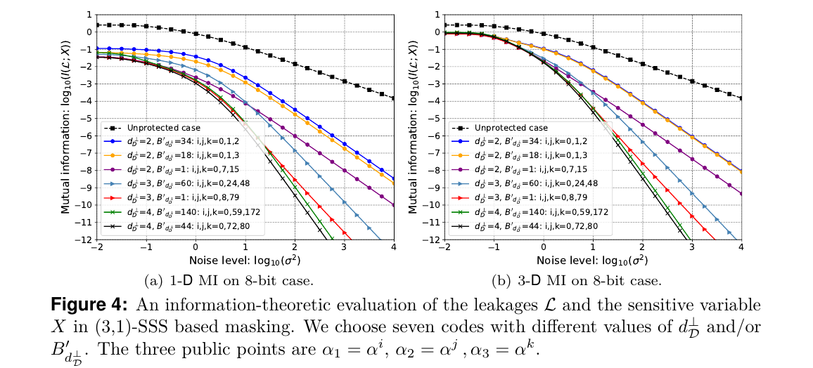
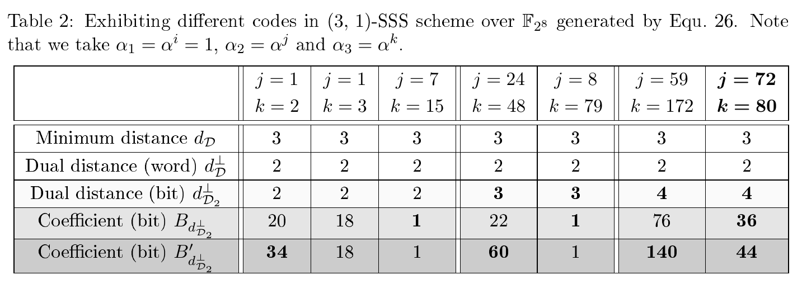
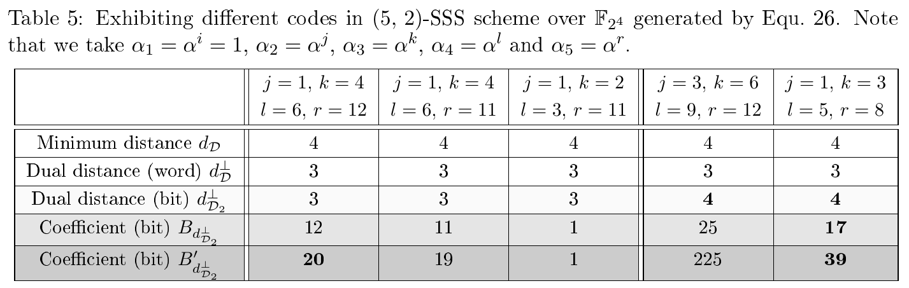
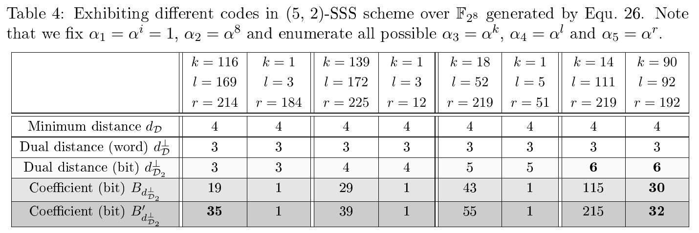

<h1 align="center">Open-source for Quantifying Information
Leakages in GCM</h1>

This repo is created for the open-source of the paper `Information Leakages in Code-based Masking: A Unified Quantification Approach`, which would appear in [TCHES 2021](https://ches.iacr.org/2021), issue 3. All the data and scripts would allow researchers to verify and reproduce our results.

## 1 Generalized Code-based Masking

We present a unified framework for quantifying the side-channel resistance of the Generalized Code-based Masking (GCM). We call the GCM, which includes Direct Sum Masking (DSM), Leakage Squeezing (LS), Inner Product Masking (IPM), Shamir's Secret Sharing (SSS) based polynomial masking and also Boolean masking. Note that the Boolean masking is not a special case of SSS-based masking.

- [x] A note of caution: the abbreviation GCM here should not be confused with the Galois/Counter Mode (GCM), which is a mode of operation for symmetric-key block ciphers (e.g., AES-GCM).

The overview of GCM is as follows. <!--[[under_submission]](#references)--> 

 

The uniform representation of encoding in GCM is: $Z=X\mathbf{G}+Y\mathbf{H}$ where $Z,X,Y$ are the masked variable, the sensitive variable and the random masks, $\mathbf{G}$ and $\mathbf{H}$ are generator matrices of the linear codes $\mathcal{C}$ and $\mathcal{D}$, respectively. Relying on the unified representation, the comparison of encodings in above code-based masking are shown below. 

 

## 2 Optimal codes for SSS-based masking & GCM

As the applications, we present hereafter an exhaustive study of the linear codes for two cases of $n$ and $t$ show the optimal codes that can be a takeaway conclusion. Specifically,
  - (3,1)-SSS-based masking with $n=3$ shares and $t=1$
  - (5,2)-SSS-based masking with $n=5$ shares and $t=2$

### 2.1 (3,1)-SSS-based masking on $l$=4 bits

See here: [Optimal codes for SSS-based masking (**$l$=4**).](https://nbviewer.jupyter.org/github/Qomo-CHENG/GeneralizedCM/blob/master/python/optimal_codes_sss_3_1_4b.ipynb)

The optimal codes are given in **[Tab. II](https://nbviewer.jupyter.org/github/Qomo-CHENG/GeneralizedCM/blob/master/python/optimal_codes_sss_3_1_4b.ipynb)** in Section 2.

Some codes with different parameters are shown as follows.

 

### 2.2 (3,1)-SSS-based masking on $l$=8 bits

See here: [Optimal codes for SSS-based masking (**$l$=8**).](https://nbviewer.jupyter.org/github/Qomo-CHENG/GeneralizedCM/blob/master/python/optimal_codes_sss_3_1_8b.ipynb)

The optimal codes are given in **[Tab. II](https://nbviewer.jupyter.org/github/Qomo-CHENG/GeneralizedCM/blob/master/python/optimal_codes_sss_3_1_8b.ipynb)** in Section 2.

An information-theoretic investigation (by mutual information) of seven codes for (3,1)-SSS based polynomial masking are shown below. Note that one of the three optimal codes is the black curve in Fig. 4.

 

Some codes with different parameters are shown as follows.

 

### 2.3 (5,2)-SSS-based masking on $l$=4 bits

See here: [Optimal codes for SSS-based masking (**$l$=4**).](https://nbviewer.jupyter.org/github/Qomo-CHENG/GeneralizedCM/blob/master/python/optimal_codes_sss_5_2_4b.ipynb)

The optimal codes are given in **[Tab. II](https://nbviewer.jupyter.org/github/Qomo-CHENG/GeneralizedCM/blob/master/python/optimal_codes_sss_5_2_4b.ipynb)** in Section 2.

Some codes with different parameters are shown as follows.

 

### 2.4 (5,2)-SSS-based masking on $l$=8 bits

See here: [Optimal codes for SSS-based masking (**$l$=8**).](https://nbviewer.jupyter.org/github/Qomo-CHENG/GeneralizedCM/blob/master/python/optimal_codes_sss_5_2_8b.ipynb)

Part of codes with the maximized **dual distance d** are given in **[Tab. II](https://nbviewer.jupyter.org/github/Qomo-CHENG/GeneralizedCM/blob/master/python/optimal_codes_sss_5_2_8b.ipynb)** in Section 2. We also provide all possible values of $B_d$ when $d$ equals 6 in Table III.

Some codes with different parameters are shown as follows.

 

## 3 Magma scripts

We share the Magma scripts to easily check the validity of our results, see here: [Magma scripts](https://github.com/Qomo-CHENG/GeneralizedCM/blob/master/magma/gen_codes_sss_3_1_4b.m). The corresponding logs are also provided here: [Magma logs](https://github.com/Qomo-CHENG/GeneralizedCM/blob/master/magma/gen_codes_sss_3_1_4b.log) for weight enumerators of the corresponding linear codes.

 

## Contacts
- Wei Cheng (wei.cheng AT telecom-paris.fr)
- Sylvain Guilley (sylvain.guilley AT secure-ic.com)

 

## Copyright and License

This repository is placed into the public domain. Anyone can redistribute it and/or modify it under the terms of the [GNU General Public License version 3.0](https://www.gnu.org/licenses/gpl-3.0.html).

Copyright (C) 2020. All Rights Reserved to Authors.

 

## References

[[BFG+17]](#references) Josep Balasch, Sebastian Faust, Benedikt Gierlichs, Clara Paglialonga, François-Xavier Standaert.
Consolidating Inner Product Masking. ASIACRYPT (1) 2017: 724-754.

[[WMCS20]](#references) Weijia Wang, Pierrick Méaux, Gaëtan Cassiers, François-Xavier Standaert. Efficient and Private Computations with Code-Based Masking. IACR Trans. Cryptogr. Hardw. Embed. Syst. 2020(2): 128-171 (2020).

[[CGC+20]](#references) Wei Cheng, Sylvain Guilley, Claude Carlet, Sihem Mesnager and Jean-Luc Danger, Optimizing Inner Product Masking Scheme by A Coding Theory Approach. The IEEE Transactions on Information Forensics and Security, [doi: 10.1109/TIFS.2020.3009609](https://ieeexplore.ieee.org/document/9141357).
