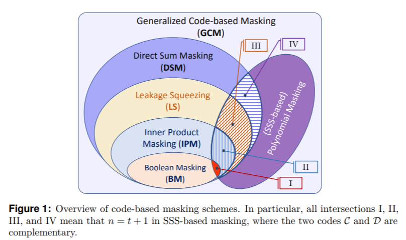

## 1 Generalized Code-based Masking
We present a unified framework for quantifying the side-channel resistance of the Generalized Code-based Masking (GCM). We call the GCM, which includes Direct Sum Masking (DSM), Leakage Squeezing (LS), Inner Product Masking (IPM), Shamir's Secret Sharing (SSS) based polynomial masking and also Boolean masking. 

The overview of GCM as follows. <!--[[under_submission]](#references)-->

- [x] A note of caution: the abbreviation GCM here should not be confused with the Galois/Counter Mode (GCM), which is a mode of operation for symmetric-key block ciphers (e.g., AES-GCM).

## 2 Optimal codes for SSS-based masking

As the applications, we present hereafter an exhaustive study of the linear codes for (3,1)-SSS-based masking with $n=3$ shares and $t=1$, and show the optimal codes that can be a takeaway conclusion.

### 2.1 (3,1)-SSS-based masking on $l$=4 bits

See here: [Optimal codes for SSS-based masking (**$l$=4**).](https://nbviewer.jupyter.org/github/Qomo-CHENG/GeneralizedCM/blob/master/python/optimal_codes_sss_3_1_4b.ipynb)

The optimal codes are given in **[Tab. II](https://nbviewer.jupyter.org/github/Qomo-CHENG/GeneralizedCM/blob/master/python/optimal_codes_sss_3_1_4b.ipynb)** in Section 2.

### 2.2 (3,1)-SSS-based masking on $l$=8 bits

See here: [Optimal codes for SSS-based masking (**$l$=8**).](https://nbviewer.jupyter.org/github/Qomo-CHENG/GeneralizedCM/blob/master/python/optimal_codes_sss_3_1_8b.ipynb)

The optimal codes are given in **[Tab. II](https://nbviewer.jupyter.org/github/Qomo-CHENG/GeneralizedCM/blob/master/python/optimal_codes_sss_3_1_8b.ipynb)** in Section 2.

An information-theoretic investigation (by mutual information) of all codes for (3,1)-SSS based polynomial masking are shown below. Note that one of the three optimal codes is the black curve in Fig. 4.
The overview of GCM as follows. <!--[[under_submission]](#references)-->

### 2.3 (5,2)-SSS-based masking on $l$=4 bits

See here: [Optimal codes for SSS-based masking (**$l$=4**).](https://github.com/Qomo-CHENG/GeneralizedCM/blob/master/python/optimal_codes_sss_5_2_4b.ipynb.pdf)

The optimal codes are given in **[Tab. II](https://github.com/Qomo-CHENG/GeneralizedCM/blob/master/python/optimal_codes_sss_5_2_4b.ipynb.pdf)** in Section 2.

## 3 Magma scripts

We share the Magma scripts to easily check the validity of our results. See here: [Magma scripts](https://github.com/Qomo-CHENG/GeneralizedCM/blob/master/magma/gen_codes_sss_3_1_4b.m). The corresponding logs are also provided here: [Magma logs](https://github.com/Qomo-CHENG/GeneralizedCM/blob/master/magma/gen_codes_sss_3_1_4b.log) for weight enumerators of the corresponding linear codes.

## Authors
- XXX XXX 
- XXX XXX (Anonymized under the submission process)

## Copyright and License

This repository is placed into the public domain. Anyone can redistribute it and/or modify it under the terms of the GNU General Public License version 3.0.

Copyright (C) 2020. All Rights Reserved to Authors.

## References
